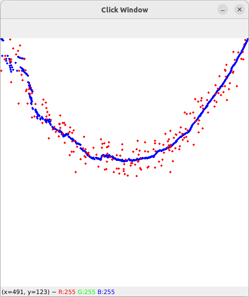
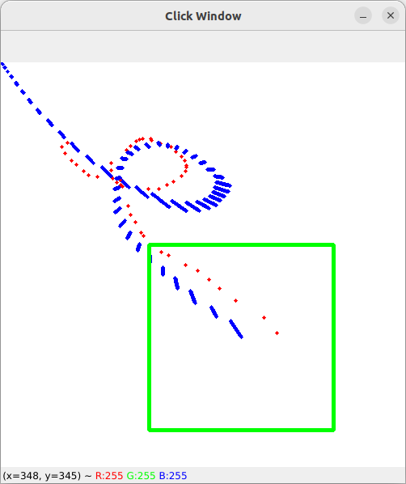

# Updates
Not yet.

# Submission format

**The submission deadline is Jan 16 (Tuesday), 8:00am 2024.**
 
You should submit via moodle.
Resulting videos should be played by your script using opencv.

# Description

You are given `main.py` file that contains implementation of the Kalman filter. 
You are also given 2 videos of robot moving a red ball, which have some parts grayed out.

Your task (described later in more detail) is to:
1. Change the implementation of the Kalman filter so that the movement is modeled as having constant acceleration. Verify that your solution approximates parabola in `PredefinedClickReader` well.
2. Fill the implementation of `draw_uncertainty` so that it draws uncertainty of kalman filter prediction on the image.
3. Use your Kalman filter to predict where the ball in the video is when the video is grayed out.

# Task 1

You are given an implementation of Kalman filter that assumes constant velocity.
```python
class KalmanFilter:
    def __init__(self, process_var, measurement_var_x, measurement_var_y):
        # process_var: process variance, represents uncertainty in the model
        # measurement_var: measurement variance, represents measurement noise

        ### TODO
        ### Change the model to constant acceleration model

        # Measurement Matrix
        self.H = np.array([[1, 0, 0, 0], [0, 1, 0, 0]])

        # Process Covariance Matrix
        self.Q = np.eye(4) * process_var

        # Measurement Covariance Matrix
        self.R = np.array(
            [
                [measurement_var_x, 0],
                [0, measurement_var_y],
            ]
        )

        # Initial State Covariance Matrix
        self.P = np.eye(4)

        # Initial State
        self.x = np.zeros(4)

    def predict(self, dt):
        # State Transition Matrix
        A = np.array([[1, 0, dt, 0], [0, 1, 0, dt], [0, 0, 1, 0], [0, 0, 0, 1]])

        # Predict the next state
        self.x = A @ self.x
        self.P = A @ self.P @ A.T + self.Q
        print(f"Predicted State: {self.x}")

    def update(self, measurement):
        # Update the state with the new measurement
        print(f"Measurement: {measurement}")
        y = measurement - self.H @ self.x
        print(f"y: {y}")
        S = self.H @ self.P @ self.H.T + self.R
        K = self.P @ self.H.T @ np.linalg.inv(S)
        self.x += K @ y
        self.P = (np.eye(4) - K @ self.H) @ self.P

```
Change it, so that it assumes constant acceleration instead. Do not use higher order terms in matrix `A` (e.g. `dt^2`).

Then, verify that your implementation works well with `PredefinedClickReader`. 
Read the implementation of `parabola_generator` and set `measurement_var_x` and `measurement_var_y` when initializing `PrededinedClickReader` accordingly. 
Calling `run` should produce output like this:


# Task 2
```python
def draw_uncertainty(kf, img):
    ### TODO
    ### Draw uncertainty
    pass
```
Fill the implementation of the `draw_uncertainty` function, so that it draws the area where (according to the filter) next state will be with ~90% cerntainty.

Your final solution might look something like this:


# Task 3

In `main.py` you are given an implementation of `VideoReader`:
```python
class VideoReader:
    def __init__(
        self,
        process_var,
        measurement_var,
        video_path,
        window_name="Video Window",
        fps=29.97,
    ):
        self.video = cv2.VideoCapture(video_path)
        self.kf = KalmanFilter(process_var, measurement_var, measurement_var)
        self.window_name = window_name
        cv2.namedWindow(window_name)
        self.fps = fps

    def run(self):
        ### TODO
        ### Set initial position using the first frame
        while True:
            ret, frame = self.video.read()
            if not ret:
                break
            ### TODO
            ### Find the red ball in the frame
            ### Use Kalman Filter to track the ball and predict its position
            cv2.imshow(self.window_name, frame)
            if cv2.waitKey(1) & 0xFF == 27:
                break

        cv2.destroyAllWindows()
```
Use your implementation of Kalman filter to predict where the red ball is on the videos: `line.mp4` and `sinewave.mp4`. 
Draw the predicted position on every frame where the ball cound not be detected.

Note: you may use first frame of the video to set correct initial position. 
Also, if initial prediction for velocity or acceleration (`0`) is incorrect, you can set initial variance to higher value.
